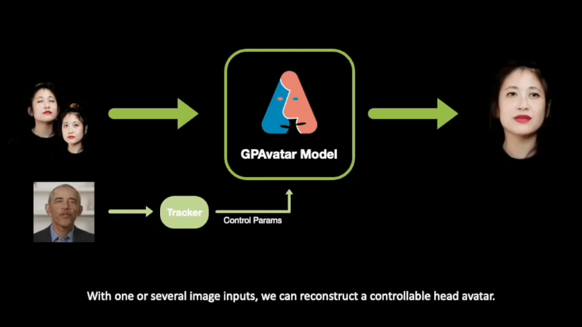

<h1 align="center"><b></b></h1>
<h3 align="center">
    <a href='https://arxiv.org/abs/2401.10215'></a> &nbsp; 
    <a href='https://xg-chu.site/project_gpavatar/'></a> &nbsp; 
    <a href='https://www.youtube.com/watch?v=7A3DMaB6Zk0'></a> &nbsp; 
</h3>


<h5 align="center">
    <a href="https://xg-chu.site">Xuangeng Chu</a><sup>1,2</sup>&emsp;
    <a href="https://yu-li.github.io">Yu Li</a><sup>2</sup>&emsp;
    <a href="https://ailingzeng.site">Ailing Zeng</a><sup>2</sup>&emsp;
    <a href="https://tianyu-yang.com">Tianyu Yang</a><sup>2</sup>&emsp;
    <a href="https://scholar.google.com/citations?user=Xf5_TfcAAAAJ&hl=zh-CN">Lijian Lin</a><sup>2</sup>&emsp;
    <a href="http://liuyunfei.net">Yunfei Liu</a><sup>2</sup>&emsp;
    <a href="https://www.mi.t.u-tokyo.ac.jp/harada/">Tatsuya Harada</a><sup>1,3</sup>
    <br>
    <sup>1</sup>The University of Tokyo,
    <sup>2</sup>International Digital Economy Academy (IDEA),
    <sup>3</sup>RIKEN AIP
</h5>

<h3 align="center">
🤩ICLR 2024🤩
</h3>

<div align="center"> 
    <div align="center"> 
        <b></b>
    </div>
    <b>
        GPAvatar reconstructs controllable 3D head avatars from one or several images in a single forward pass.
    </b>
    <br>
    <b>
        More results can be seen from our <a href="https://xg-chu.github.io/project_gpavatar/">Project Page</a>.
    </b>
</div>

<!-- ## TO DO
We are now preparing the <b>pre-trained model and quick start materials</b> and will release it within a week. -->

## Installation
<details>
<summary><span >Install step by step</span></summary>

```
conda create -n track python=3.9
conda install pytorch==2.0.1 torchvision==0.15.2 torchaudio==2.0.2 pytorch-cuda=11.8 -c pytorch -c nvidia
conda install -c fvcore -c iopath -c conda-forge fvcore iopath
conda install pytorch3d -c pytorch3d
pip3 install mediapipe tqdm rich lmdb einops colored ninja av opencv-python scikit-image onnxruntime-gpu onnx transformers pykalman
pip3 install pytorch-lightning==2.1.3
<!-- pip3 install git+https://github.com/nerfstudio-project/nerfacc.git -->
pip3 install nerfacc==0.5.3 -f https://nerfacc-bucket.s3.us-west-2.amazonaws.com/whl/torch-2.0.0_cu118.html
```
</details>

<details>

<summary><span style="font-weight: bold;">Install with environment.yml (recommend)</span></summary>

```
conda env create -f environment.yml
conda activate GPAvatar
pip3 install nerfacc==0.5.3 -f https://nerfacc-bucket.s3.us-west-2.amazonaws.com/whl/torch-2.0.0_cu118.html
```

</details>

<details>

<summary><span>Run with Dockerfile</span></summary>

```
If your environment has unknown or unsolvable issues, please use the Dockerfile in https://github.com/xg-chu/lightning_track as a final solution.
```

</details>

## Preparation
Build resources with ```bash ./build_resources.sh```.

Download the [model checkpoint](https://github.com/xg-chu/GPAvatar/releases/download/v1.0.0/one_model.ckpt) and put it at ```checkpoints/one_model.ckpt```.

## Quick Start
Driven by images:
```
python inference.py -r ./checkpoints/one_model.ckpt --driver ./demos/drivers/pdriver --input ./demos/examples/real1
```
or driven by video:
```
python inference.py -r ./checkpoints/one_model.ckpt --driver ./demos/drivers/vdriver1 --input ./demos/examples/art1 -v
``` 

## Fast Inference
Please refer to ```inference_ready2go.py``` for some quick inference tools. There are some scripts for easy inference with given only expression features, or given input and target images.

## How to build the dataset for training

<details>
<summary><span>Build dataset</span></summary>

In lightning tracking, there is a ```track_lmdb.py``` script that can easily track expressions in a large number of discontinuous images. (We recommend sampling some discontinuous frames from the video to build a dataset to avoid sampling adjacent frames with too similar expressions during training.)

Building the dataset used for training requires img_lmdb, dataset.pkl and camera.json.
```
img_lmdb:
‘img_007914_79’ : image # refer to the lmdb_utiils.py, there is also API to build a lmdb. 007914 is video id (used when sampling), 79 is frame id.

dataset.pkl:
- dict_keys(['records', 'meta_info'])
	- “records": dict_keys(['img_007914_79', ‘img_007914_99', …])
		- "img_007914_79": dict_keys(['bbox', 'kps', 'mica_shape', 'emoca_expression', 'emoca_pose', 'transform_matrix’]) # can get from lightning.pkl generated by lightning_traking
	- ‘meta_info’: dict_keys(['train', 'val', ‘test'])
		- "train": list(['img_004997_80', ‘img_000630_159'])
		- "val": …
		- “test": ...

camera.json:
{"flame_scale": 5.0, "focal_length": 12.0, "principal_point": [0.0, 0.0]} # be same with lightning_tracking, other numbers may also be OK.
```
</details>

<details>
<summary><span>Training</span></summary>
    
```
python train.py --config one --dataset vfhq
```
</details>

## Citation
If you find our work useful in your research, please consider citing:
```bibtex
@inproceedings{
    chu2024gpavatar,
    title={{GPA}vatar: Generalizable and Precise Head Avatar from Image(s)},
    author={Xuangeng Chu and Yu Li and Ailing Zeng and Tianyu Yang and Lijian Lin and Yunfei Liu and Tatsuya Harada},
    booktitle={The Twelfth International Conference on Learning Representations},
    year={2024},
    url={https://openreview.net/forum?id=hgehGq2bDv}
}
```

## Acknowledgements
Some part of our work is built based on FLAME, StyleMatte, EMOCA and MICA. 
The GPAvatar Logo is designed by Caihong Ning.
We thank you for sharing their wonderful code and their wonderful work.
- **FLAME**: https://flame.is.tue.mpg.de
- **StyleMatte**: https://github.com/chroneus/stylematte
- **EMOCA**: https://github.com/radekd91/emoca
- **MICA**: https://github.com/Zielon/MICA

